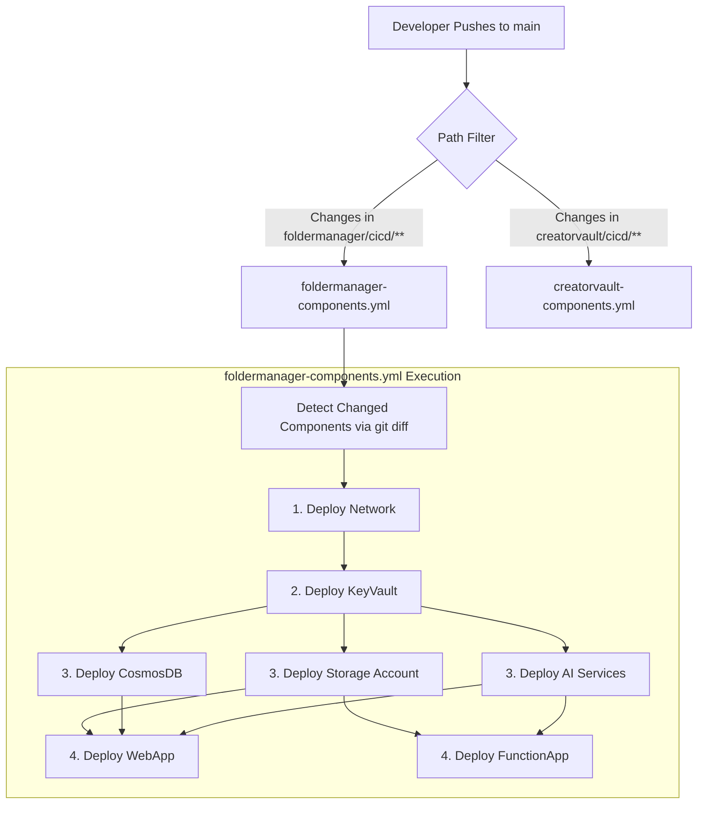

# Infrastructure Deployment Design & Flow

This document details the architectural design and continuous delivery flow for the `infrastructure-deployments` monorepo. It explains the "Component-by-Component" methodology, state isolation, and the automated pipeline workflows.

## 1. Architectural Philosophy: Monorepo Infra / Polyrepo Apps

The RahulTech organization utilizes a distinct split between application code and infrastructure code:
- **Application Polyrepos**: Each web application or service (e.g., `rahultech-web`, `creatorvault-app`) lives in its own directory or repository.
- **Infrastructure Monorepo**: All cloud infrastructure (AWS, Azure, GCP) is centralized in the `infrastructure-deployments` folder. This provides a single pane of glass for cloud governance, cost tracking, and security compliance.

## 2. The Component-Based Skeleton

Rather than managing a single massive Terraform state file for an entire project, infrastructure is broken down into **independent, highly cohesive components**. 

### Directory Structure

```text
infrastructure-deployments/
├── .github/workflows/                 # Pipeline orchestration
│   ├── rahulsite-components.yml
│   ├── foldermanager-components.yml
│   ├── creatorvault-components.yml
│   └── ...
├── modules/                           # Reusable Terraform modules (DRY principle)
│   ├── aws/
│   ├── azure/
│   └── gcp/
└── {project-name}/                    # Project boundary
    └── cicd/                          # Deployment environment
        ├── network/                   # Independent Component
        │   ├── main.tf                
        │   ├── variables.tf
        │   └── terraform.tfvars
        ├── database/                  # Independent Component
        └── webapp/                    # Independent Component
```

### Why Components?
1. **Minimized Blast Radius**: A syntax error or accidental deletion in the `webapp` deployment cannot destroy the `network` or `database` resources because they use entirely separate state files.
2. **Speed**: Terraform only evaluates the graph of a single component at a time, making `plan` and `apply` operations lightning fast.
3. **Targeted Deployments**: The pipeline detects exactly which folder changed and only deploys that specific component.

## 3. Remote State Management & Isolation

Every component has its own isolated remote state backend, partitioned by project and cloud provider.

| Cloud Provider | State Storage | State Locking | Authentication |
| :--- | :--- | :--- | :--- |
| **Azure** (`rahulsite`, `foldermanager`) | Azure Blob Storage container (`tfstate`) | Native to Blob Storage | Entra ID (OIDC) via GitHub Actions |
| **AWS** (`creatorvault`) | S3 Bucket (`terraform-state-rahultech`) | DynamoDB table (`terraform-state-lock`) | IAM Roles (OIDC) via GitHub Actions |
| **GCP** (`stocksite`, `kidsapp`) | GCS Bucket (`terraform-state-rahultech-gcp`) | Native to GCS | Workload Identity Federation (OIDC) |

*State Key Pattern:* `{project}/{component}/terraform.tfstate` (e.g., `creatorvault/vpc/terraform.tfstate`)

## 4. CI/CD Pipeline Workflow

The GitHub Actions workflows (`*-components.yml`) are the heart of the deployment mechanism. They follow a strict Directed Acyclic Graph (DAG) to ensure dependencies are respected.

### The Deployment Flow



### Pipeline Features:
1. **Smart Detection**: A job named `detect-changes` uses `git diff` to identify which component directories were modified in the commit. It outputs an array of changed components.
2. **Conditional Execution**: Each subsequent job (e.g., `network`, `database`) contains an `if` condition. It only runs if its name is in the changed array OR if the workflow was manually triggered via `workflow_dispatch`.
3. **Dependency Enforcement**: Jobs use the `needs:` keyword. The `webapp` job `needs: [database, network]`. Even if only the `webapp` changed, it waits for the `database` job to finish evaluating (which will instantly succeed and skip if unchanged).
4. **OIDC Authentication**: **Zero long-lived credentials**. Pipelines dynamically request short-lived JWT tokens from the cloud providers.

## 5. Secrets and Variable Injection

No secrets are stored in Terraform files. The flow for secrets is:
1. Infrastructure components provision Secret Managers (Azure Key Vault, AWS Secrets Manager, GCP Secret Manager).
2. Infrastructure components store generated keys (e.g., Database connection strings, API keys) directly into the Secret Manager.
3. Application infrastructure (e.g., Azure Web App, GCP Cloud Run) is granted a Managed Identity / IAM Role to read those specific secrets at runtime.
4. Environment-specific variables (e.g., instance sizing, regions) are managed openly in the component's `terraform.tfvars`.


## 6. Industry Multi-Cloud Standard: IaC Monorepo with Separated State

Based on engineering blogs from top tech organizations (often discussed in HashiCorp keynotes, LinkedIn Engineering, and DevOps YouTube channels), the structure we just built is known as the "Infrastructure-as-Code (IaC) Monorepo with Separated State".

It is the absolute gold standard for multi-cloud environments. Here is how top organizations structure their Git repositories for multi-cloud production, and exactly how our setup mirrors it:

### The Industry Standard Multi-Cloud Git Structure
When companies operate across AWS, Azure, and GCP, they typically avoid creating dozens of tiny repositories. Instead, they use a single Infrastructure Repository governed by strict folder hierarchies and CI/CD rules:

```text
infrastructure-repo/ (What we named infrastructure-deployments)
│
├── .github/                     # 1. Governance & Automation
│   ├── workflows/               # CI/CD pipelines that ONLY trigger on specific folder changes
│   ├── CODEOWNERS               # Security: Forces Cloud Architects to approve module changes
│
├── modules/                     # 2. The "Cloud Library" (Blueprints)
│   ├── aws/                     # Standardized AWS S3, VPC, ECS definitions
│   ├── azure/                   # Standardized Azure App Service, CosmosDB definitions
│   └── gcp/                     # Standardized GCP Cloud Run, BigQuery definitions
│
├── environments/ (Or Projects)  # 3. The "Live" State (Execution)
│   ├── rahulsite/               # Uses Azure modules
│   │   ├── network/             # Separate Terraform State!
│   │   └── webapp/              # Separate Terraform State!
│   ├── creatorvault/            # Uses AWS modules
│   │   ├── vpc/
│   │   └── ecs-fargate/
│   └── stocksite/               # Uses GCP modules
```

### Why Organizations Use This Exact Pattern:
- **The Blast Radius Problem (State Isolation)**: In multi-cloud, if Azure goes down or GCP has an API change, it shouldn't crash your AWS deployment. By breaking projects down into components (e.g., creatorvault/vpc and creatorvault/ecs-fargate), each folder gets its own isolated `terraform.tfstate`. If the webapp deployment fails, the network state is completely untouched.
- **The DRY Principle via `modules/`**: Top organizations do not let developers write raw Terraform resources in production. Instead, Platform Engineers write the code in `modules/aws/s3` with strict security defaults (encryption forced on, public access blocked). Then, the project folders (`creatorvault/s3`) simply call that module.
- **Smart CI/CD Pipelines (The DAG)**: In multi-cloud, a pipeline that runs terraform apply across everything takes hours and is dangerous. The `.github/workflows/` we set up uses Path Filtering. If a developer only changes `rahulsite/webapp/main.tf`, the CI/CD pipeline detects that specific path, authenticates only to Azure via OIDC, and applies only the web app.